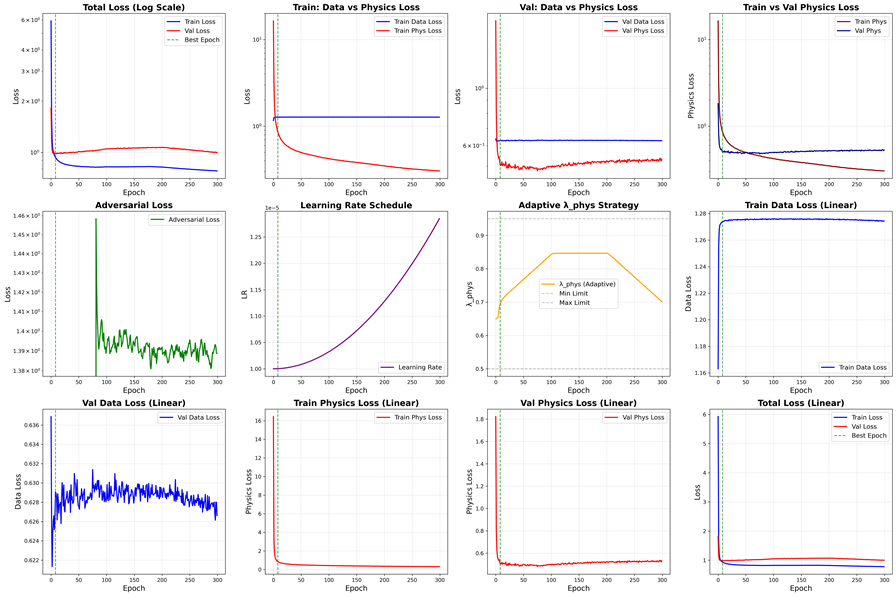

 MST-GAN-Structure
> An Industrial-Grade Platform for Structural Dynamic Response Generation based on Multi-Scale Transformer & Physics-Informed GAN.

项目背景 (Background)
在实际的结构健康监测（SHM）与数字孪生应用中，传感器收集到的数据往往伴随强烈的复杂环境噪声。本项目提出了一种创新的物理信息对抗生成网络 (Physics-Informed GAN)，巧妙融合了多尺度卷积与 Transformer 架构，致力于在极高噪声环境下，依然能鲁棒且高保真地重构结构动力响应并进行状态评估。

核心技术栈 (Core Technologies)
CNN 局部特征提取 (Multi-Scale CNN): 采用多分支不同大小的感受野（Kernel size: 3, 5, 7, 11, 15），精准捕获激励信号的瞬态冲击与低频稳态等局部特征。
全局序列建模 (Transformer Encoder): 引入自注意力机制建立长序列全局依赖，解决超长结构响应序列的长期记忆衰减问题。
物理约束判别机制 (Physics-Discriminator): 设计基于真实结构动力学方程的对抗博弈机制，引导网络生成的响应不仅“逼真”，更严格遵循物理定律（如牛顿第二定律）。

系统亮点 (Highlights)
抗噪鲁棒性提升: 引入基于统计分位数（中位数与 IQR）的 Robust 归一化策略，大幅削弱极端脉冲噪声对训练的干扰。
动态 λphys 自适应调节: 独创的物理损失权重动态分配算法，有效避免数据损失与物理约束之间的梯度冲突。
工业级全景监控画板: 系统内置训练动态实时追踪，自动生成 12 维度的复杂状态面板。

运行效果与监控 (Performance Dashboard)
下图展示了系统在 300 Epoch 周期内的完整动态监控面板。包含总损失收敛趋势、生成器与判别器的对抗博弈（Adversarial Loss 于 Epoch 80 准时切入）、以及 λphys 的丝滑自适应调节过程。



快速部署 (Quick Start)
1. 环境依赖:
   ```bash
   pip install torch numpy scipy matplotlib tqdm
